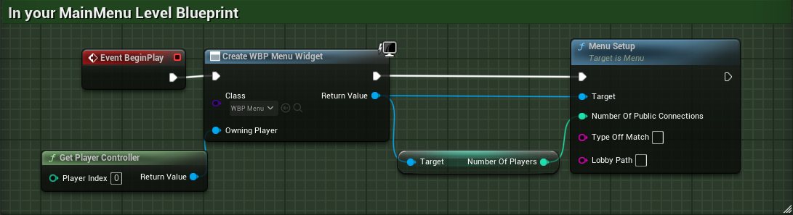

# MultiplayerPlugin-UnrealEngine 5.4
Plugin for handling online multiplayer sessions in UE 5.4 
 
Made by following **Stephen Ulibarri**'s course _Create a fast-paced, competitive multiplayer shooter in Unreal Engine 5 using C++!_
This plugin uses the `OnlineSubsystemSteam` plugin to create and manage multiplayer sessions. It is a simple plugin that allows you to create a session with the choice of player number, join a session, and destroy a session.

## Configuration
1. Clone the repository
2. Open the file folder at the root of your project
3. If it does not exist, create a new folder called `Plugins`
4. Copy the `MultiplayerSession` folder into the `Plugins` folder
5. Add the following lines to the `DefaultEngine.ini` file
```
[/Script/Engine.GameEngine]
+NetDriverDefinitions=(DefName="GameNetDriver",DriverClassName="OnlineSubsystemSteam.SteamNetDriver",DriverClassNameFallback="OnlineSubsystemUtils.IpNetDriver")

[OnlineSubsystem]
DefaultPlatformService=Steam

[OnlineSubsystemSteam]
bEnabled=true
SteamDevAppId=480
bInitServerOnClient=true
bUseSteamNetworking=true
bUseLobbiesIfAvailable=true

[/Script/OnlineSubsystemSteam.SteamNetDriver]
NetConnectionClassName="OnlineSubsystemSteam.SteamNetConnection"
```
6. Add the following lines to the `DefaultGame.ini` file
```
[/Script/Engine.GameSession]
MaxPlayers=100 
```
7. Right-click on the .uproject file and select `Generate Visual Studio project files`
8. Open the project in Visual Studio and build the project
9. Open the project in Unreal Engine and enable the plugin `Online Subsytem Steam` in the `Edit` -> `Plugins` menu
10. Restart the editor

## Configuration
 In your MainMenu level, create a new `Level Blueprint` and add the following nodes:

 - TypeOfMatch will be the type of match you want to create, it can be a `QuickMatch`, `CustomMatch`, `FreeForAll`, ...
 - LobbyPath is the path to the level you want to load after creating the session. 
 - You can get it by right-clicking on it, then `Copy File Path` and replace the path up to `/Content/` with `/Game/` and removing the `.umap` extension.
_**Exemple :** for the ThirdPersonMap it is `/Game/ThirdPerson/Maps/ThirdPersonMap`_

## Use & Testing
Since it uses the `OnlineSubsystemSteam` plugin, you will need to have Steam running on your computer to test the plugin. You can test the plugin by creating a session and joining it with another player. The other player need to be on another computer with a different Steam account.
